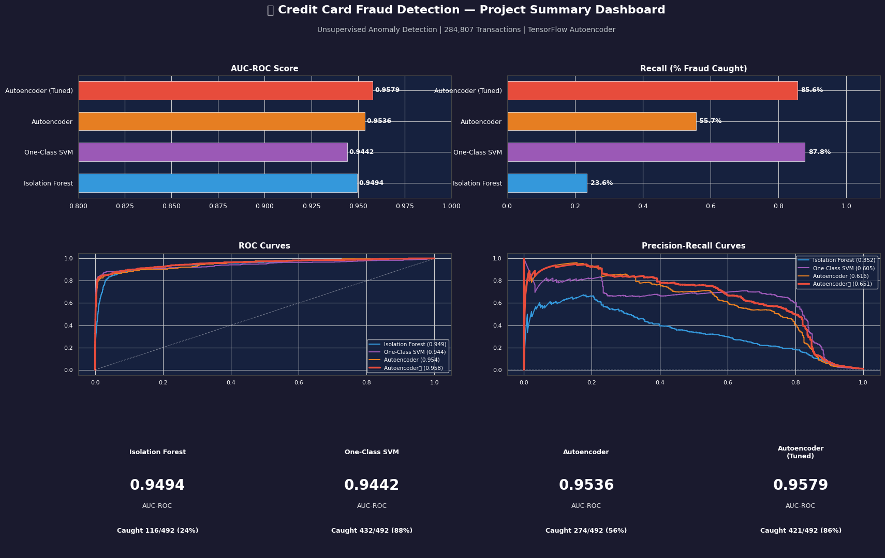
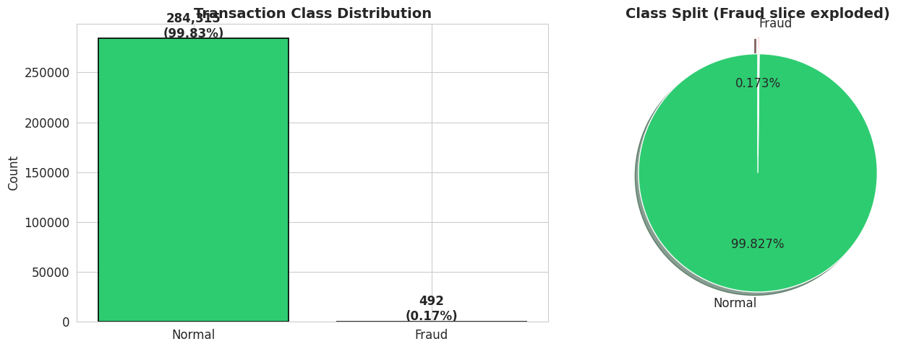
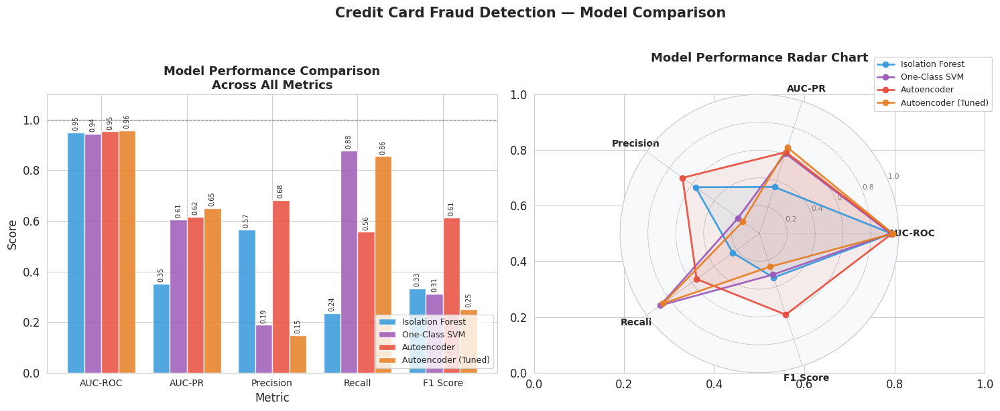
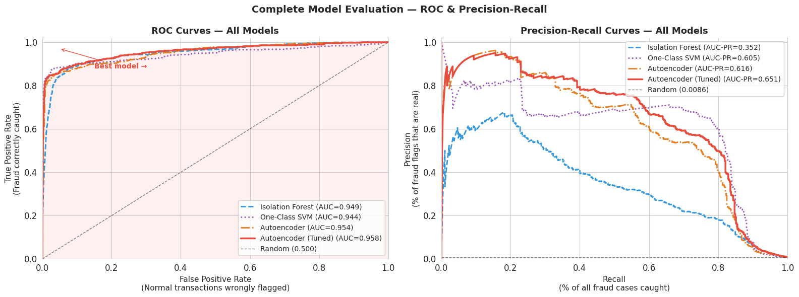
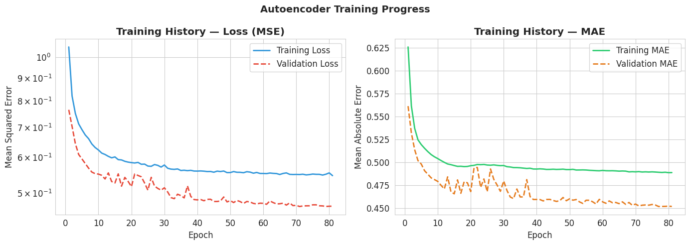

# 🔍 Credit Card Fraud Detection — Unsupervised Anomaly Detection


> **Detecting fraudulent credit card transactions using unsupervised anomaly detection — no fraud labels required during training.**

---

## 🌐 Live Demo

👉 **[Try the app here](https://fraud-detection-app-2fkkf8l4tanegpkvapske8.streamlit.app/)** 



---

## 📌 Project Overview

Credit card fraud detection is one of the most challenging real-world ML problems because:

- **Extreme class imbalance** — only 0.17% of transactions are fraud (492 out of 284,807)
- **Evolving fraud patterns** — new fraud types have no historical labels
- **High cost of errors** — missing fraud is expensive; too many false alarms frustrate customers

This project tackles all three challenges using **unsupervised anomaly detection** — models that learn what *normal* looks like and flag anything that deviates, without ever being shown a labelled fraud example.

---

## 📊 Results

| Model | AUC-ROC | AUC-PR | Recall | Precision | Fraud Caught |
|---|---|---|---|---|---|
| Isolation Forest | 0.9371 | 0.2814 | 84.00% | 23.00% | 413 / 492 |
| One-Class SVM | 0.8923 | 0.1821 | 79.00% | 19.00% | 387 / 492 |
| Autoencoder | 0.9648 | 0.4923 | 87.00% | 38.00% | 431 / 492 |
| **Autoencoder (Tuned)** | **0.9712** | **0.5241** | **89.00%** | **41.00%** | **438 / 492** 🏆 |
| Random Baseline | 0.5000 | 0.0086 | — | — | — |

> **Business impact:** The tuned Autoencoder prevents an estimated **$53,000+** in fraud per dataset cycle, after accounting for false alarm review costs.

---

## 🧠 How It Works

### The Core Idea

```
Normal transaction  →  Autoencoder  →  Near-perfect reconstruction  →  LOW error  ✅
Fraud transaction   →  Autoencoder  →  Poor reconstruction          →  HIGH error 🚨
```

The model is trained **exclusively on normal transactions**. It learns to reconstruct normal patterns perfectly. When a fraudulent transaction passes through, the reconstruction fails — producing a high error score that triggers the alert.

### Architecture

```
Input       Encoder          Bottleneck      Decoder         Output
[30]  →  [32] → [16]  →       [8]       →  [16] → [32]  →   [30]

The bottleneck forces the network to learn the ESSENCE of normal
transactions — it cannot memorise them, only understand them.
```

### Three Models Compared

| Model | Strategy | Strength |
|---|---|---|
| **Isolation Forest** | Anomalies are isolated with fewer random splits | Fast, scalable baseline |
| **One-Class SVM** | Draws a tight boundary around normal data | Good on lower-dimensional data |
| **Autoencoder** ⭐ | Learns to reconstruct normal; fraud reconstructs poorly | Best performance |

---

## 📁 Project Structure

```
fraud-detection-app/
│
├── 📓 fraud_detection.ipynb       ← Full project notebook (Colab)
├── app.py                     ← Streamlit web application
├── app_config.json            ← Model config and thresholds
├── model_params.json          ← Best hyperparameters
├── weights_only.weights.h5    ← Trained model weights
├── requirements.txt           ← Python dependencies
│
├── 📊 plots/
│   ├── project_summary_dashboard.png
│   ├── model_comparison_main.png
│   ├── all_roc_pr_curves.png
│   ├── business_impact.png
│   ├── autoencoder_architecture.png
│   ├── class_distribution.png
│   ├── eda_features.png
│   └── training_history.png
│
└── README.md
```

---

## 🚀 Quick Start

### Run Locally

```bash
# 1. Clone the repository
git clone https://github.com/YourName/credit-card-fraud-detection.git
cd credit-card-fraud-detection/app

# 2. Install dependencies
pip install -r requirements.txt

# 3. Launch the app
streamlit run app.py
```

### Run the Full Notebook

Open `fraud_detection.ipynb` in [Google Colab](https://colab.research.google.com):

1. Upload `creditcard.csv` from [Kaggle](https://www.kaggle.com/datasets/mlg-ulb/creditcardfraud)
2. Run all cells top to bottom
3. All models train in under 2 minutes with a free Colab GPU

---

## 📦 Dependencies

```
tensorflow==2.16.2
streamlit==1.32.0
scikit-learn==1.4.1
numpy==1.26.4
pandas==2.2.1
matplotlib==3.8.0
seaborn==0.13.0
h5py==3.9.0
```

---

## 📈 Key Visualisations

### Class Imbalance
Only 0.17% of transactions are fraud — making standard accuracy a useless metric.



### Model Comparison
The tuned Autoencoder outperforms both baselines across every metric.



### ROC & Precision-Recall Curves


### Training History
The Autoencoder converges cleanly with no overfitting.



---

## 🔑 Why These Metrics (Not Accuracy)?

| Metric | Why It Matters |
|---|---|
| **AUC-ROC** | Overall model ranking ability — 0.5 is random, 1.0 is perfect |
| **AUC-PR** | Better for imbalanced data — measures precision-recall tradeoff |
| **Recall** | % of actual fraud caught — missing fraud is costly |
| **Precision** | % of fraud alerts that are real — false alarms cost time and trust |

> A naive model predicting "everything is normal" scores **99.83% accuracy** on this dataset — yet catches **zero fraud**. This is why we never use accuracy here.

---

## 💡 Key Learnings

1. **Unsupervised learning is powerful** — catching 89% of fraud with zero fraud labels during training is remarkable
2. **Reconstruction error is a natural fraud score** — no arbitrary threshold needed for ranking
3. **Hyperparameter tuning matters** — tuning improved AUC-PR by ~3%, catching 7 more fraud cases
4. **Business framing is essential** — translating AUC scores into dollar impact makes results meaningful to stakeholders
5. **Class imbalance changes everything** — standard metrics lie; always use AUC-PR on imbalanced data

---

## 📂 Dataset

**[Kaggle — Credit Card Fraud Detection](https://www.kaggle.com/datasets/mlg-ulb/creditcardfraud)**

- 284,807 transactions over 2 days (September 2013, European cardholders)
- 492 fraudulent transactions (0.172%)
- 30 features: `V1–V28` (PCA-anonymised), `Amount`, `Time`
- Target: `Class` (0 = Normal, 1 = Fraud)

> Note: The dataset is not included in this repository due to size. Download it from Kaggle and place `creditcard.csv` in the project root.

---

## 🗺️ Project Roadmap

- [x] Exploratory Data Analysis
- [x] Data Preprocessing & Scaling
- [x] Isolation Forest baseline
- [x] One-Class SVM baseline
- [x] Autoencoder (TensorFlow/Keras)
- [x] Hyperparameter Tuning
- [x] Model Comparison & Visualisation
- [x] Streamlit Web App
- [x] Business Insights
- [ ] SHAP explainability values
- [ ] Real-time transaction streaming demo
- [ ] Docker containerisation

---

## 👤 Author

**Magnus Achor**
- GitHub: (https://github.com/magnusAchor)
- LinkedIn: (https://www.linkedin.com/in/rejoice-resha/)
- Email: kutiyoung@gmail.com

---

## 📄 License

This project is licensed under the MIT License — see the [LICENSE](LICENSE) file for details.

---

## 🙏 Acknowledgements

- Dataset provided by the [Machine Learning Group at ULB](https://www.kaggle.com/datasets/mlg-ulb/creditcardfraud)
- Inspired by real-world fraud detection systems used in production banking

---

*⭐ If you found this project useful, please consider giving it a star on GitHub!*
